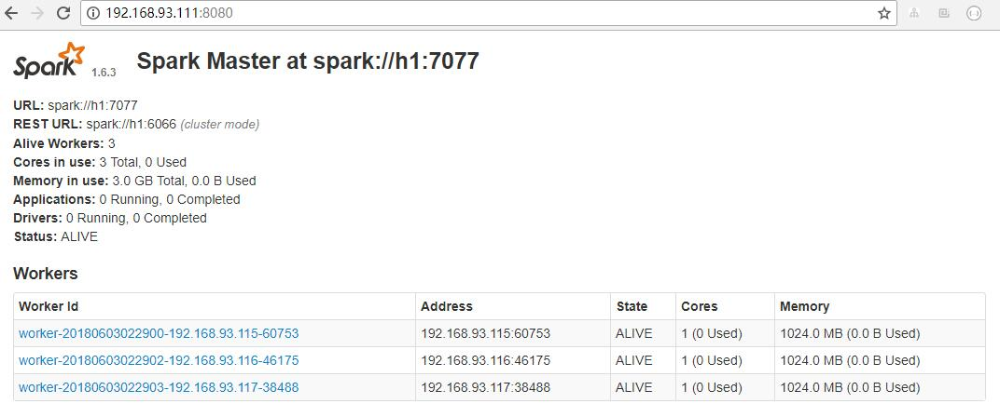
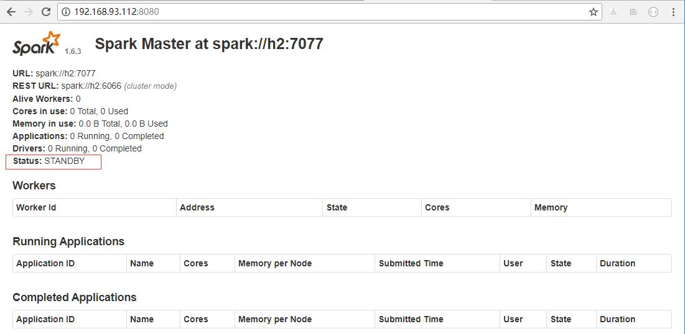
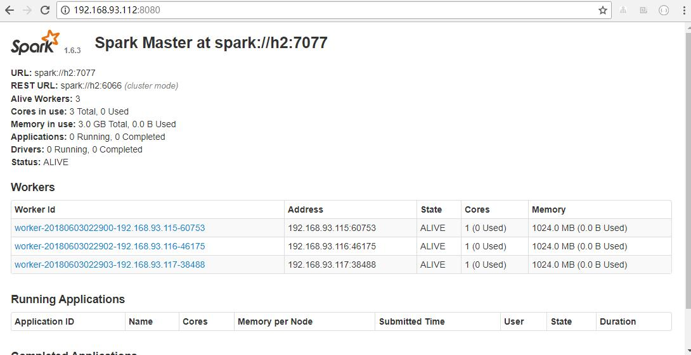

### spark 入门


#### 一. 安装
 - 1 软件版本:
    - hadoop:2.7.5(理应是2.6.x)
    - Spark:1.6.3
    - Scala:2.10.6 
    
 - 2 安装步骤
    - 将spark安装包上传到linux目录上并解压
    - 进入到spark目录的conf目录下:`cd $SPARK_HOME/conf`
    - `cp spark-env.sh.template spark-env.sh`
    - `vim spark-env.sh`
        ```shell
          #配置jdk路径
          export JAVA_HOME=/usr/install/jdk1.7.0_79
          # 配置master节点
          export SPARK_MASTER_IP=h1 
          # 配置master的端口号
          export SPARK_MASTER_PORT=7077
        ```
    - 配置worker节点 `vim slaves`
        ```sbtshell
          h1
          h2
        ```
    -  将整个spark 安装包拷贝到h2,h3节点:
        - 进入到spark安装目录的上一层
        - 拷贝到h2: `scp -r spark hadoop@h2:$PWD`
        - 拷贝到h3: `scp -r spark hadoop@h3:$PWD`
    - 如果需要配置spark的环境变量的话,需要到/etc/profile目录下配置,配置方式如hadoop一样,有`$SPARK_HOME/bin` 和 `$SPARK_HOME/sbin`
#### 二.启动Spark
 - 1 在h1(master)上执行:`$SPARK_HOME/sbin/start-all.sh`,启动结束后,各节点的进程情况:
    - h1:<br/>
       
    - h2:<br/>
       
    - h3:<br/>
          
 - 2 进程启动后的问题思考:
    - h2或者h3上分别只有一个worker进程,难道就只能有一个worker进程吗?<br/>
    &nbsp; &nbsp;&nbsp; &nbsp;理论上每个节点可以启动多个worker进程,但是在实际中往往是一个节点启动一个worker进程就够了.worker的作用就相当于hdfs中的nodemanager,
    负责本节点的资源调度,当接收到一个分析任务后,worker就开辟一块jvm内存空间,
    然后在启动自己的一个子进程**CoarseGrainedExecutorBackend**,来运行开辟的那块空间里边.
    - 在启动worker的时候,在配置文件并没给worker指定端口号,它不需要我们手动去指定端口号,而是自己给自己指定一个临时端口号,等把集群关闭,下次再启动的时候,
    有可能worker自己的端口号又变了.
 - 3 使用webUI查看:`http://h1:8080`<br/>
    
    
#### 三. 案例测试
 - 1 使用$SPARK_HOIME/bin下的spark-submit脚本提交测试任务:
    ```sbtshell
       spark-submit \
       #指定要运行的程序入口
       --class org.apache.spark.examples.SparkPi \
       #指定spark
       --master spark://h1:7077 \
       #指定每个worker节点的运行内存
       --executor-memory 512m \
       #指定运行该程序的总的cpu核数
       --total-executor-cores 2 \
       #指定jar包位置
       /home/hadoop1/devlop_env/spark/lib/spark-examples-1.6.3-hadoop2.6.0.jar \
       #指定运行的参数 
       
    ```
    任务提交后,可到web ui中查看正在进行的一些进程信息,测试结果:`Pi is roughly 3.1416222283244455`
 - 2 可运行spark-shell 脚本进行Scala的交互式编程:
    
    上图中启动的是单机版的spark shell,并且在worker节点不会有新进程启动
    
    启动集群版本的spark-shell:<br/>
    
    ```sbtshell
       ./spark-shell \
       --master spark://h1:7077
       #若不指定memory和cores,也能启动,内部按照默认的进行分配
       --executor-memory 512m \
       --total-executor-cores 2
    ```
    在worker节点会有CoarseGrainedExecutorBackend进程启动.
   
 - 3 在集群版的spark-shell进行wordcount编程,这个案例需要启动hdfs集群.
    - 先准备3个文件上传到hdfs上<br/>
        ```sbtshell
          wc1.txt:
          hello java scala hello
          ---------------------
          wc2.txt:
          hello c++ c# hello
          hello
          --------------------
          hello python c# hello
          hello
          hello
        ```
    - 在集群版的spark-shell中编写如下代码:<br/>
        ```sbtshell
          sc.textFile("hdfs://h1:9000/spark/wc").flatMap(_.split(" ")).map((_,1)).reduceByKey(_+_).collect
        ```
        运行结果如下:
        
#### 四. Idea 中Scala编程测试
 - 1.依旧上面的统计单词个数,Scala代码如下:
    [SparkWordCount.scala](../src/main/scala/com/ljy/day06/SparkWordCount.scala)
    ```scala
    package com.ljy.day06
    
    import org.apache.spark.rdd.RDD
    import org.apache.spark.{SparkConf, SparkContext}
    
    
    object SparkWordCount {
      def main(args: Array[String]): Unit = {
        //创建配置信息
        //setAppName :设置应用程序名称
        //setMaster:设置为班底运行,需要指定线程数
        //其中:"local"是指单线程来运行
        // "local[2]"是指调用两个线程模拟集群
        //"local[*]"是指有多少空闲线程就用多少
        val conf = new SparkConf()
          .setAppName("SparkWordCount")
          .setMaster("local[2]") //本地运行
    
        //创建上下文对象
        val sc: SparkContext = new SparkContext(conf)
        //读取数据
        val lines: RDD[String] = sc.textFile("hdfs://h1:9000/spark/wc")
    
        //将数据切分并压平
        val words: RDD[String] = lines.flatMap(_.split(" "))
    
        //将单词生成元组
        val tuples: RDD[(String, Int)] = words.map((_, 1))
        //将数据聚合
        val reduced: RDD[(String, Int)] = tuples.reduceByKey(_ + _)
    
        //降序排序,true:表示升序,false 降序
        val sorted: RDD[(String, Int)] = reduced.sortBy(_._2, false)
        //collect将RDD转化成数组
        println(sorted.collect().toBuffer)
        //将数据存到hdfs
        sorted.saveAsTextFile("hdfs://h1:9000/spark/wc/out/out_20180531")
        sc.stop()
      }
    }

    ```
 - 2.在本地安装windows版本的hadoop客户端,[下载地址](https://download.csdn.net/download/lljjyy001/10451061)
 - 3.解压后配置好环境变量,变量名为HADOOP_HOME,变量值为解压路径,如我的为`E:\INSTALL\windows-hadoop-bin-2.0.0`
 - 4.点击Idea的运行按钮即可运行,如果最后执行结果返回0,则表示运行成功,可在输出日志中查看到输出结果,也可以到hdfs上如代码中指定的路径下查看执行结果.
 - 5.修改代码,然后打包上传到linux上,使用spark命令执行,
     代码修改的地方如下,注释掉本地运行的设置即可.<br/>
     ```scala
          val conf = new SparkConf()
          .setAppName("SparkWordCount")
          //.setMaster("local[2]") //本地运行
     ```
 - 6 上传到linux的某个目录下.
 - 7 编写执行脚本submit.sh.<br/>
    ```sbtshell
       #!/bin/bash
       #程序入口,运行时参数传入
       export mainClass=$1
       #jar包位置,运行时参数传入
       export jar=$2
       #指定spark-submit的路径
       export spark_submit=/home/hadoop1/devlop_env/spark/bin/spark-submit
       export runMaster=spark://h1:7077
       export memory=512m
       export cores=2
       
       ${spark_submit} --class $mainClass --master $runMaster --executor-me
       mory $memory --total-executor-cores $cores $jar
       
       echo "END"
    ```
 - 8 进入到submit.sh所在目录,执行脚本<br/>
    ```sbtshell
       #我的jar包就传到了submit.sh所在的目录
       ./submit.sh com.ljy.day06.SparkWordCount Day06.jar
    ```
 - 9 运行完后,可到hdfs上查看结果.
 
#### Idea中java代码编程测试.
  - 1.java代码如下[JavaWordCount.java](../src/main/scala/com/ljy/day06/JavaWordCount.java)
    ```java
        package com.ljy.day06;
        
        import org.apache.spark.SparkConf;
        import org.apache.spark.api.java.JavaPairRDD;
        import org.apache.spark.api.java.JavaRDD;
        import org.apache.spark.api.java.JavaSparkContext;
        import org.apache.spark.api.java.function.FlatMapFunction;
        import org.apache.spark.api.java.function.Function2;
        import org.apache.spark.api.java.function.PairFunction;
        import scala.Tuple2;
        
        import java.util.Arrays;
        
        public class JavaWordCount {
            public static void main(String[] args) {
                //创建配置信息类
                /*模板代码*/
                SparkConf conf = new SparkConf()
                        .setAppName("JavaWC");
                        .setMaster("local[*]");
        
                //上传上下文对象
                JavaSparkContext jsc = new JavaSparkContext(conf);
        
                //获取数据
                JavaRDD<String> lines = jsc.textFile("hdfs://h1:9000/spark/wc");
        
                //切分数据
                JavaRDD<String> words = lines.flatMap(new FlatMapFunction<String, String>() {
                    @Override
                    public Iterable<String> call(String s) throws Exception {
                        return Arrays.asList(s.split(" "));
                    }
                });
        
                //把数据生成元组
                JavaPairRDD<String, Integer> tuples = words.mapToPair(new PairFunction<String, String, Integer>() {
                    @Override
                    public Tuple2<String, Integer> call(String s) throws Exception {
                        return new Tuple2<>(s, 1);
                    }
                });
        
                //聚合数据
                JavaPairRDD<String, Integer> reduced = tuples.reduceByKey(new Function2<Integer, Integer, Integer>() {
                    @Override
                    public Integer call(Integer v1, Integer v2) throws Exception {
                        return v1 + v2;
                    }
                });
        
                //颠倒<key,value>---> <value,key>
                JavaPairRDD<Integer, String> reversed = reduced.mapToPair(new PairFunction<Tuple2<String, Integer>, Integer, String>() {
                    @Override
                    public Tuple2<Integer, String> call(Tuple2<String, Integer> tup) throws Exception {
                        return tup.swap();
                    }
                }/*new Tuple2<>(keyvalue._2, keyvalue._1)*/);
        
                //排序,false-->降序
                JavaPairRDD<Integer, String> sorted = reversed.sortByKey(false);
                //反转数据
                JavaPairRDD<String, Integer> res = sorted.mapToPair(new PairFunction<Tuple2<Integer, String>, String, Integer>() {
                    @Override
                    public Tuple2<String, Integer> call(Tuple2<Integer, String> tup) throws Exception {
                        return tup.swap();
                    }
                });
        
                System.out.println(res.collect());
        
                res.saveAsTextFile("hdfs://h1:9000/spark/wc/out/out_20180531-java");
                jsc.stop();
        
            }
        }

    ```
  - 2 配置上面所说的环境变量后,点击Idea的运行按钮即可运行.
  - 3 修改代码,按照四中的方式打包上传到linux,并用上面的submit.sh脚本运行jar包即可,修改的代码:
    ```java
    SparkConf conf = new SparkConf()
               .setAppName("JavaWC");
               //.setMaster("local[*]");
    ```
  
#### 遇到的问题以及解决方案:
    
  - 问题1:编写好代码后,首次点击Idea运行代码的时候,出现了以下问题:
    ```java
        ...
        Successfully stopped SparkContext
        Exception in thread "main" java.lang.SecurityException: class "javax.servlet.ServletRegistration"'s signer information does not match signer information of other classes in the same package
        	at java.lang.ClassLoader.checkCerts(ClassLoader.java:898)
        	at java.lang.ClassLoader.preDefineClass(ClassLoader.java:668)
        	at java.lang.ClassLoader.defineClass(ClassLoader.java:761)
        	at java.security.SecureClassLoader.defineClass(SecureClassLoader.java:142)
        	at java.net.URLClassLoader.defineClass(URLClassLoader.java:467)
        	at java.net.URLClassLoader.access$100(URLClassLoader.java:73)
        	at java.net.URLClassLoader$1.run(URLClassLoader.java:368)
        	at java.net.URLClassLoader$1.run(URLClassLoader.java:362)
        	at java.security.AccessController.doPrivileged(Native Method)
        	at java.net.URLClassLoader.findClass(URLClassLoader.java:361)
        	at java.lang.ClassLoader.loadClass(ClassLoader.java:424)
        	at sun.misc.Launcher$AppClassLoader.loadClass(Launcher.java:338)
        	at java.lang.ClassLoader.loadClass(ClassLoader.java:357)
        	at org.spark-project.jetty.servlet.ServletContextHandler.<init>(ServletContextHandler.java:136)
        	at org.spark-project.jetty.servlet.ServletContextHandler.<init>(ServletContextHandler.java:129)
        	at org.spark-project.jetty.servlet.ServletContextHandler.<init>(ServletContextHandler.java:98)
        	at org.apache.spark.ui.JettyUtils$.createServletHandler(JettyUtils.scala:126)
        	at org.apache.spark.ui.JettyUtils$.createServletHandler(JettyUtils.scala:113)
        	at org.apache.spark.ui.WebUI.attachPage(WebUI.scala:78)
        	at org.apache.spark.ui.WebUI$$anonfun$attachTab$1.apply(WebUI.scala:62)
        	at org.apache.spark.ui.WebUI$$anonfun$attachTab$1.apply(WebUI.scala:62)
        	at scala.collection.mutable.ResizableArray$class.foreach(ResizableArray.scala:59)
        	at scala.collection.mutable.ArrayBuffer.foreach(ArrayBuffer.scala:47)
        	at org.apache.spark.ui.WebUI.attachTab(WebUI.scala:62)
        	at org.apache.spark.ui.SparkUI.initialize(SparkUI.scala:63)
        	at org.apache.spark.ui.SparkUI.<init>(SparkUI.scala:76)
        	at org.apache.spark.ui.SparkUI$.create(SparkUI.scala:195)
        	at org.apache.spark.ui.SparkUI$.createLiveUI(SparkUI.scala:146)
        	at org.apache.spark.SparkContext.<init>(SparkContext.scala:473)
        	at com.ljy.day06.SparkWordCount$.main(SparkWordCount.scala:20)
        	at com.ljy.day06.SparkWordCount.main(SparkWordCount.scala)
        ...

    ```
    解决方案:<br/>
    出现这样问题的原因是:在maven中依赖包顺序的问题,<br/>
    我之前的依赖顺序是:<br/>
    hadoop--->org.scala-lang-->org.apache.spark<br/>
    然后报了以上错误<br/>
    修改如下后再运行,就不报错了<br/>
    org.scala-lang-->org.apache.spark--->hadoop(或者直接不依赖hadoop)<br/>
  
  - 问题2:在linux的spark上运行的时候报错,错误情况如下:
    ```java
        ...
        Exception in thread "main" java.lang.UnsupportedClassVersionError: com/ljy/day06/JavaWordCount : Unsupported major.minor version 52.0
                    at java.lang.ClassLoader.defineClass1(Native Method)
                    at java.lang.ClassLoader.defineClass(ClassLoader.java:800)
                    at java.security.SecureClassLoader.defineClass(SecureClassLoader.java:142)
                    at java.net.URLClassLoader.defineClass(URLClassLoader.java:449)
                    at java.net.URLClassLoader.access$100(URLClassLoader.java:71)
                    at java.net.URLClassLoader$1.run(URLClassLoader.java:361)
                    at java.net.URLClassLoader$1.run(URLClassLoader.java:355)
                    at java.security.AccessController.doPrivileged(Native Method)
                    at java.net.URLClassLoader.findClass(URLClassLoader.java:354)
                    at java.lang.ClassLoader.loadClass(ClassLoader.java:425)
                    at java.lang.ClassLoader.loadClass(ClassLoader.java:358)
                    at java.lang.Class.forName0(Native Method)
                    at java.lang.Class.forName(Class.java:274)
                    at org.apache.spark.util.Utils$.classForName(Utils.scala:175)
                    at org.apache.spark.deploy.SparkSubmit$.org$apache$spark$deploy$SparkSubmit$$runMain(SparkSubmit.scala:689)
                    at org.apache.spark.deploy.SparkSubmit$.doRunMain$1(SparkSubmit.scala:181)
                    at org.apache.spark.deploy.SparkSubmit$.submit(SparkSubmit.scala:206)
                    at org.apache.spark.deploy.SparkSubmit$.main(SparkSubmit.scala:121)
                    at org.apache.spark.deploy.SparkSubmit.main(SparkSubmit.scala)
        ...
    ```
    原因:编译的jar包的jdk版本与运行的jdk版本不一致,编译的时候用的是jdk8,linux服务器上的是jdk7<br/>
    解决方案:linux因为配置了很多的环境变量,改起来比较费劲,在windows上安装jdk7,然后编辑代码打包的时候换成jdk7即可.<br/>
    
    
  
#### 配置高可用Spark集群
   - 前提:在已有高可用hadoop集群的基础上搭建
        ```sbtshell
         | 主机名 | 安装的软件         | 运行的进程                                                |
         | ------ | ----------------- | ----------------------------------------------------------|
         | h1    | hadoop            | NameNode、DFSZKFailoverController(zkfc)、Master           |
         | h2    | hadoop            | NameNode、DFSZKFailoverController(zkfc)、Master           |
         | H3    | hadoop            | ResourceManager                                           |
         | H4    | hadoop            | ResourceManager                                           |
         | H5    | hadoop、zookeeper | DataNode、NodeManager、JournalNode、QuorumPeerMain、worker |
         | H6    | hadoop、zookeeper | DataNode、NodeManager、JournalNode、QuorumPeerMain、worker |
         | H7    | hadoop、zookeeper | DataNode、NodeManager、JournalNode、QuorumPeerMain、worker |
         
        ```
   - 配置h1上的spark/conf/spark-env.sh文件:
        ```sbtshell
        export JAVA_HOME=/usr/install/jdk1.7.0_79
        #export SPARK_MASTER_IP=h1
        export SPARK_MASTER_PORT=7077
        export SPARK_DAEMON_JAVA_OPTS="-Dspark.deploy.recoveryMode=ZOOKEEPER -Dspark.deploy.zookeepe
        r.url=h5:2181,h6:2181,h7:2181 -Dspark.deploy.zookeeper.dir=/spark"
        export HADOOP_HOME=/home/hadoop1/devlop_env/hadoop-2.7.5
        export HADOOP_CONF_DIR=/home/hadoop1/devlop_env/hadoop-2.7.5/etc/hadoop
        
        ```   
   - 配置h1上的spark/conf/slaves文件
        h5
        h6
        h7
   
   - 将配置好的spark包分发到h2,h5,h6,h7上
        ```sbtshell
             scp -r spark hadoop1@h2:$PWD
             scp -r spark hadoop1@h5:$PWD
             scp -r spark hadoop1@h6:$PWD
             scp -r spark hadoop1@h7:$PWD
        ```
   - 分别在h5,h6,h7上启动zookeeper集群
        ```sbtshell
             h5:
             cd /home/hadoop1/devlop_env/zookeeper-3.4.7
             ./bin/zkServer.sh start
             
             h6:
             cd /home/hadoop1/devlop_env/zookeeper-3.4.7
             ./bin/zkServer.sh start
             
             h7:
             cd /home/hadoop1/devlop_env/zookeeper-3.4.7
             ./bin/zkServer.sh start
        ```
   
   - 启动hadoop集群
        ```sbtshell
             start-all.sh
        ```
   - 启动spark集群:
        ```sbtshell
         h1:
         $SPARK_HOME/bin/start-all.sh
         h2:
         $SPARK_HOME/bin/start-master.sh
        ```
   - 各节点进程情况:
        ```sbtshell
             [hadoop1@h1 sbin]$ jps
             3903 Master
             3473 NameNode
             4012 Jps
             3784 DFSZKFailoverController
             [hadoop1@h1 sbin]$ 
        ```
        
        ```sbtshell
             [hadoop1@h2 sbin]$ jps
             3235 Jps
             2852 NameNode
             3122 Master
             2963 DFSZKFailoverController
             [hadoop1@h2 sbin]$ 
        ```
        
        ```sbtshell
             [hadoop1@h3 ~]$ jps
             2222 ResourceManager
             2523 Jps
             [hadoop1@h3 ~]$ 
        ```
        
        ```sbtshell
             [hadoop1@h4 ~]$ jps
             2353 Jps
             2273 ResourceManager
             [hadoop1@h4 ~]$ 
        ```
        
        ```sbtshell
             [hadoop1@h5 current]$ jps
             3115 Jps
             2097 QuorumPeerMain
             3038 Worker
             2755 JournalNode
             2653 DataNode
             2875 NodeManager
             [hadoop1@h5 current]$ 
        ```
        
        ```sbtshell
             hadoop1@h6 current]$ jps
             2083 QuorumPeerMain
             3032 Worker
             2879 NodeManager
             2757 JournalNode
             2655 DataNode
             3108 Jps
             [hadoop1@h6 current]$ 
        ```
        
        ```sbtshell
             [hadoop1@h7 current]$ jps
             3034 Jps
             2712 JournalNode
             2087 QuorumPeerMain
             2609 DataNode
             2982 Worker
             2829 NodeManager
             [hadoop1@h7 current]$ 
        ```
   
   - h1 WebUI:<br/>
    
   
   - h2 WebUI:<br/>
    
    
   - 高可用测试:
        - 1 将h1的master进程kill
            ```sbtshell
                 [hadoop1@h1 sbin]$ kill -9 3903
                 [hadoop1@h1 sbin]$ jps
                 3473 NameNode
                 4052 Jps
                 3784 DFSZKFailoverController
                 [hadoop1@h1 sbin]$ 
            ```
        - 2 刷新h2的WebUI:<br/>
        
          
          
          
HA Spark 搭建完成 