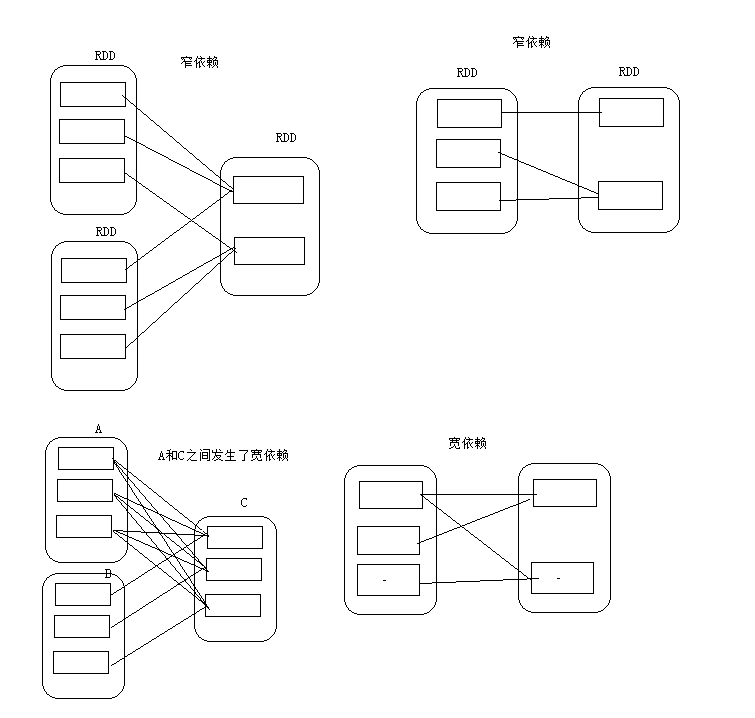
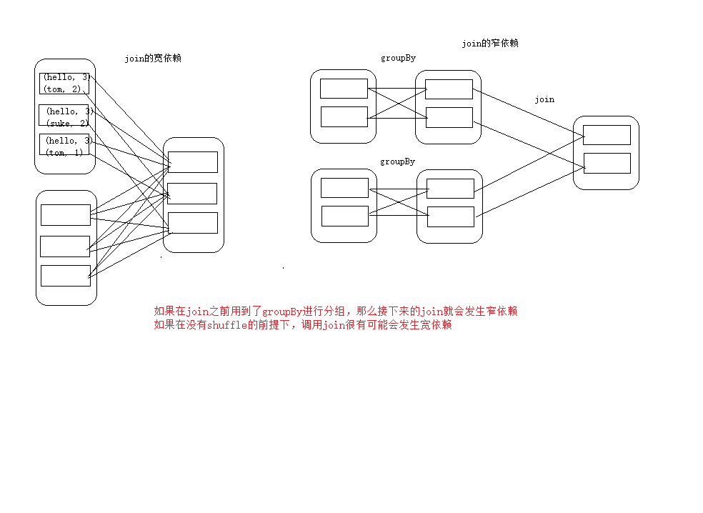
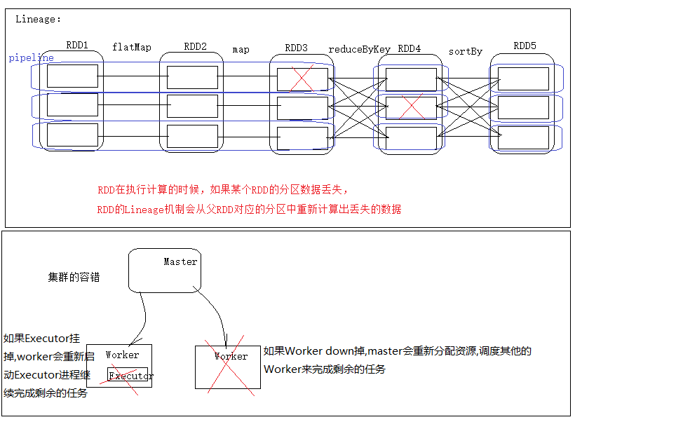
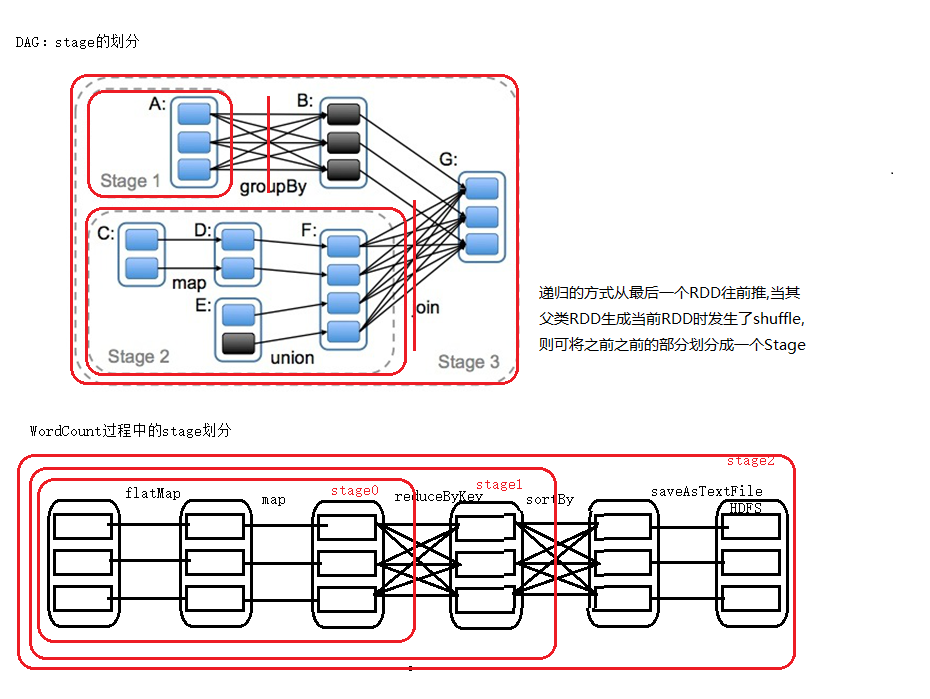
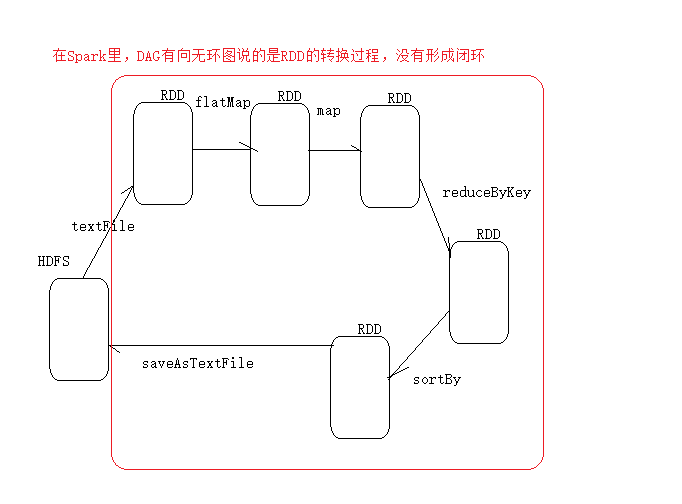
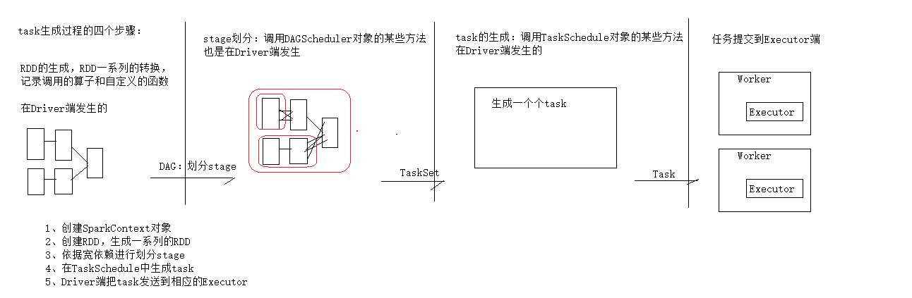

### Spark启动流程
    
   - 1 调用start-adll.sh启动Master服务(进程)
   - 2 start-all.sh会找到Slave配置文件,遍历出需要在那些节点上启动Worker,开始启动Worker
   - 3 Worker进程启动后,调用生命周期方法开始向Master进行注册
   - 4 Master接收到注册信息后,把Worker的info保存到内存和磁盘(调用持久化引擎),<br/>
        Master向Worker响应注册成功的信息(把Master的URL发送给对应的Worker)
   - 5 Worker接收到Master发送过来的URL,并进行更新,开始向Master建立心跳
   - 6 Master不断的接收到Worker发送过来的心跳信息(WorkerID),Master不断的更新Worker的最后一次心跳信息
   
### Spark提交任务的流程
   - 1 Driver端:自动SparkSubmit进程,用于提交任务信息的,SparkSubmint开始向Master进行通信,发送任务信息,<br/>
        在发送任务信息的时候,发送了一个非常重要的对象(SparkConetxt)
   - 2 Master接收到任务信息后,把消息放在一个队列里面,开发获取所有的Worker,然后过滤出没有Down掉的Worker,<br/>
        再进行排序,把空闲的Worker排在前面,最后通知相应的Worker拿任务信息,并启动Executor子进程
   - 3 Executor启动后,开始和Driver端进行反向注册
   - 4 Driver开始把刚刚生成的任务发送到相应的Executor
   - 5 Executor收到任务后,开始执行任务.
   
   
### RDD依赖的两种关系
  ##### 宽依赖
   - 宽依赖是指多个子RDD的partition会依赖同一个父RDD的partition
   - 父RDD 1====>n 子RDD  一对多的关系
   
  ##### 窄依赖
   - 窄依赖是指一个父RDD的partition最多被子RDD的一个partition所使用
   - 父RDD 1====>[1,0] 子RDD  一对一的关系或一对0的关系
   
  ##### 父类RDD与子RDD的依赖关系图以及图例说明
  - 依赖关系图<br/>
  
  
  - 图例<br/>
  
  
  - join的宽依赖和窄依赖<br/>
  

### Lineage  
   RDD只支持粗粒度转换，即在大量记录上执行的单个操作。
   将创建RDD的一系列Lineage（即血统）记录下来，以便恢复丢失的分区。
   RDD的Lineage会记录RDD的元数据信息和转换行为，当该RDD的部分分区数据丢失时，
   它可以根据这些信息来重新运算和恢复丢失的数据分区。<br/>
   - 有助于lineage理解以及Lineage机制和集群容错机制的区分图:<br/>
    
  

### RDD的缓存
   spark非常快速的原因之一,就是在不同操作中可以在内存中持久化或缓存多个数据集
   当持久化某个RDD后,每一个节点都把计算的分片结果保存在内存中,并对此RDD或衍生出的RDD
   进行其他动作中重用.这使得后续的动作更加快速.RDD相关的持久化和缓存,是Spark最重要的特征之一,可以说,缓存是
   spark构建迭代式算法的和快速交互式查询的关键.
   
   
##### RDD的缓存方式
 RDD通过persist方法或者cache方法可以将前面的计算结果缓存,但是并不是这两个方法被调用时立刻缓存,而是触发后面的action
 时,该RDD将会被缓存在计算节点的内存中,并供后面使用.<br/>
 缓存有可能丢失，或者存储于内存的数据由于内存不足而被删除，
 RDD的缓存容错机制保证了即使缓存丢失也能保证计算的正确执行。
 通过基于RDD的一系列转换，丢失的数据会被重算，由于RDD的各个Partition是相对独立的，
 因此只需要计算丢失的部分即可，并不需要重算全部Partition。
 
 - 缓存的方法:
    - cache()
        ```scala
          val rdd1 = sc.textFile("hdfs://h1:9000/spark/wc").flatMap(_.split(" ")).map((_,1)).reduceByKey(_+_)
          //这样缓存里面是没有数据的,因为还没有执行action动作,只是保存了执行逻辑
          val cached = rdd1.cache()
          //需要调用action动作后,缓存里面才会有数据
          rdd1.first()
          //释放缓存
          rdd1.unpersist()
    
        ```
    - persist([level:StorageLevel])
        ```scala
            //缓存级别有:
            val NONE = new StorageLevel(false, false, false, false)
            val DISK_ONLY = new StorageLevel(true, false, false, false)
            val DISK_ONLY_2 = new StorageLevel(true, false, false, false, 2)
            val MEMORY_ONLY = new StorageLevel(false, true, false, true)
            val MEMORY_ONLY_2 = new StorageLevel(false, true, false, true, 2)
            val MEMORY_ONLY_SER = new StorageLevel(false, true, false, false)
            val MEMORY_ONLY_SER_2 = new StorageLevel(false, true, false, false, 2)
            val MEMORY_AND_DISK = new StorageLevel(true, true, false, true)
            val MEMORY_AND_DISK_2 = new StorageLevel(true, true, false, true, 2)
            val MEMORY_AND_DISK_SER = new StorageLevel(true, true, false, false)
            val MEMORY_AND_DISK_SER_2 = new StorageLevel(true, true, false, false, 2)
            val OFF_HEAP = new StorageLevel(false, false, true, false)
            
            //一般常用的是MEMORY_ONLY,默认
            
            //注意,MEMORY_AND_DISK不是内存缓存一份,本地缓存一份,而是:加入数据有5G,内存只有3G
            //先将内存的3G缓存完(原理是这样,实际不可能3G都用来缓存),剩下的再缓存到本地
      
            //OFF_HEAP:堆外内存还缓存,不会被GC回收,存到堆外内存的数据需要先序列化,但是Spark中已经处理的序列化的步骤
            
            val rdd1 = sc.textFile("hdfs://h1:9000/spark/wc").flatMap(_.split(" ")).map((_,1)).reduceByKey(_+_)
            //这样缓存里面是没有数据的,因为还没有执行action动作,只是保存了执行逻辑
            val persisted = rdd1.persist(StorageLevel.DISK_ONLY)
            //需要调用action动作后,缓存里面才会有数据
            rdd1.first()
            //释放缓存
            rdd1.unpersist()
      
        ```
 
 
### DAG的生成
DAG(Directed Acyclic Graph)叫做有向无环图，原始的RDD通过一系列的转换就就形成了DAG，
根据RDD之间的依赖关系的不同将DAG划分成不同的Stage，对于窄依赖，partition的转换处理在Stage中完成计算。
对于宽依赖，由于有Shuffle的存在，只能在parent RDD处理完成后，才能开始接下来的计算，
因此宽依赖是划分Stage的依据。<br/>

 
 - Stage划分图图例:<br/>
 
    
 
 - DVG:
    - 无回路的有向图,RDD是通过一序列的转换形成了DCG,根据不同的依赖关系,来划分Stage
    - 划分Stage的目的,就是为了生成Task
    - 划分Stage的依据:是否发生了shuffle
 
 - 关于DAG的问题<br/>
    
    
 - Task生成过程的4个步骤
    - RDD的生成,RDD一系列的转换,记录调用的算子和自定义的函数<br/>
      在Driver 端发生
      
    - Stage划分,调用了DAGScheduler对象的某些方法<br/>
      在Driver 端发生
      
    - Task的生成:调用TaskSchedule对象的某些方法<br/>
      在Driver 端发生
    
    - 任务提交到Executor<br/>
      在worker端执行
   
 - task生成并发送的四个步骤:<br/>
    
  
 - 生成task的数量与stage和pipeline是由直接关系的
 - 在任务执行过程中如果发生了shuffle,就会有shufflewrite和shuffle read
    - shuffle write:发生在shuffle之前,把要shuffle的数据先写到磁盘,这样保证了数据的安全性
 - shuffle read:发生在shuffle之后,下游的RDD读取上游RDD存储的数据.
 
 - 为什么在发生shuffle的时候,需要保存所以数据到磁盘?
    - 避免占用内存太大而可能出现OOM
    - 保存到磁盘保证了数据的安全性
