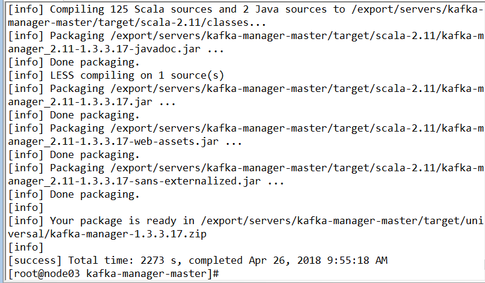
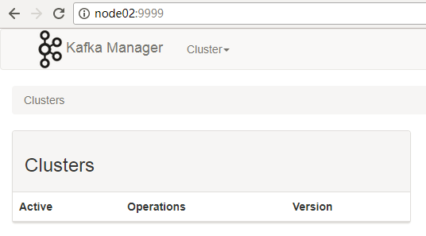
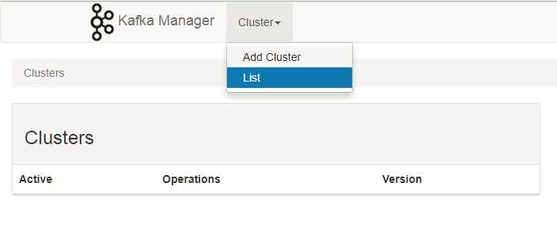
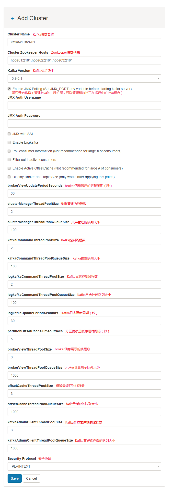
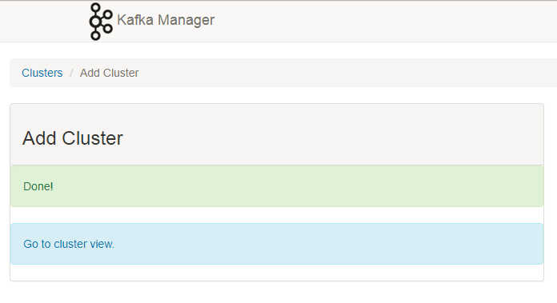
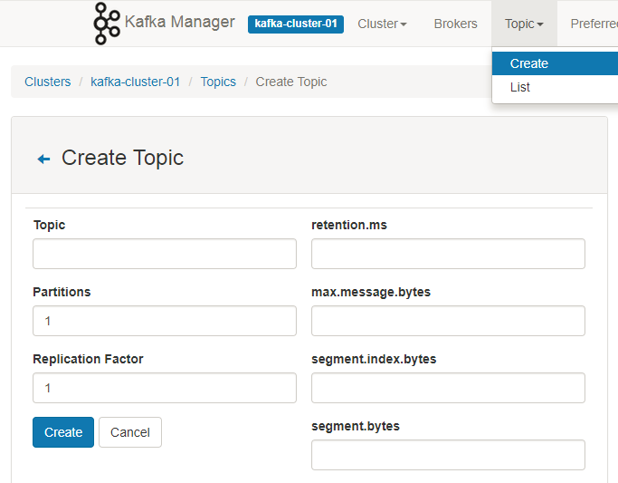
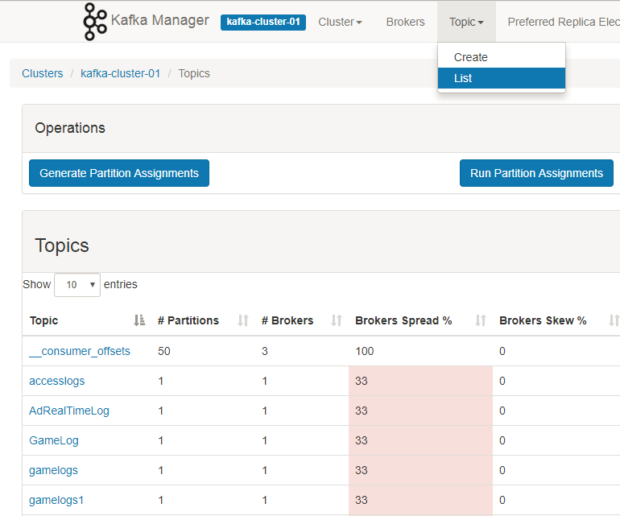

一、kafka-manager简介

为了简化开发者和服务工程师维护Kafka集群的工作，Yahoo构建了一个叫做Kafka管理器的基于Web工具，叫做 Kafka Manager。这个管理工具可以很容易地发现分布在集群中的哪些topic分布不均匀，或者是分区在整个集群分布不均匀的的情况。它支持管理多个集群、选择副本、副本重新分配以及创建Topic。同时，这个管理工具也是一个非常好的可以快速浏览这个集群的工具，有如下功能：

1.管理多个kafka集群
2.便捷的检查kafka集群状态(topics,brokers,备份分布情况,分区分布情况)
3.选择你要运行的副本
4.基于当前分区状况进行分区分配
5.可以选择topic配置并创建topic(0.8.1.1和0.8.2的配置不同)
6.删除topic(只支持0.8.2以上的版本并且要在broker配置中设置delete.topic.enable=true)
7.Topic list会指明哪些topic被删除（在0.8.2以上版本适用）
8.为已存在的topic增加分区
9.为已存在的topic更新配置
10.在多个topic上批量重分区
11.在多个topic上批量重分区(可选partition broker位置)

**kafka-manager** 项目地址：[https://github.com/yahoo/kafka-manager](https://link.jianshu.com/?t=https://github.com/yahoo/kafka-manager)

### 二、安装

#### 1.   环境要求

Kafka 0.8.1.1 或者 0.8.2.* 或者 0.9.0.*

Java 8+

zookeeper 2+

#### 2.   下载安装 kafka-manager

- 下载编译

```shell
# 下载源码包，上传到linux服务器，地址如下：
https://github.com/yahoo/kafka-manager.git
解压kafka-manager-master.zip
cd kafka-manager-master
# 因为要编译。所以下面这步操作要等很久
sbt clean distcd target/ 
# 在target/universal目录下我们可以看到 kafka-manager
kafka-manager-1.3.3.17.zip
```

**tips**:

> 使用sbt编译打包的时候时间可能会比较长，如果你hang在
> Loading project definition from kafka-manager/project
> 可以修改project/plugins.sbt中的LogLevel参数
> 将logLevel := Level.Warn修改为logLevel := Level.Debug

编译完成后的显示结果：



- 解压

```shell
unzip kafka-manager-1.3.3.17.zip -d /usr/local
cd /usr/local/kafka-manager-1.3.3.17
```

- 修改配置 conf/application.properties

```shell
# 如果zk是集群，这里填写多个zk地址
kafka-manager.zkhosts="node01:2181,node02:2181,node03:2181"
```

- 启动

```shell
nohup bin/kafka-manager &
```

kafka-manager 默认的端口是9000，可通过 -Dhttp.port，指定端口; -Dconfig.file=conf/application.conf指定配置文件:

```shell
nohup bin/kafka-manager -Dconfig.file=conf/application.conf -Dhttp.port=9999 &
```

我们用浏览器访问试试，界面非常简洁



### 三、测试 kafka-mamager

#### 1. 新建 Cluster







#### 2. 新建 topic

- 填写topic名称以及分区和副本个数

  ​

  

  ​

#### 3. 查看该集群的 topic

- kafka-manager




