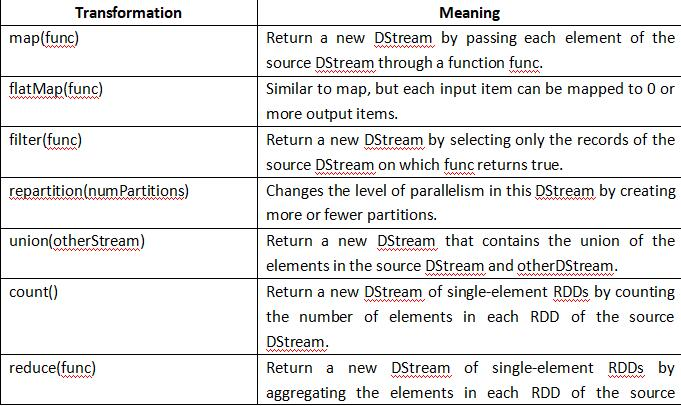
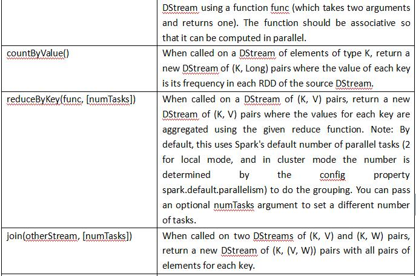
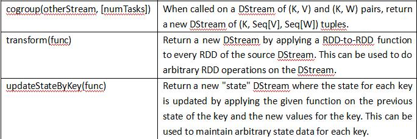
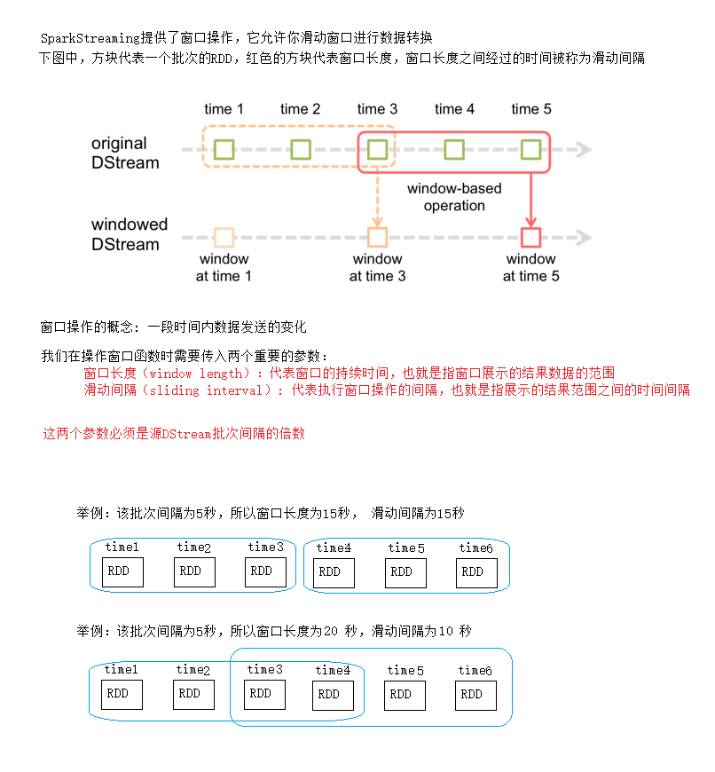
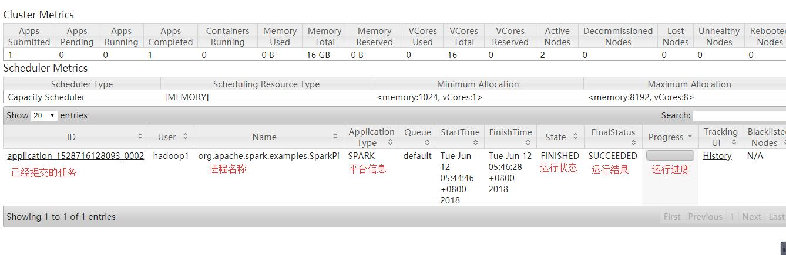
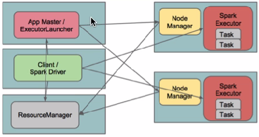

### spark-streaming
  - 什么是Spark Streaming?
    - Spark Streaming类似于Apache Storm，用于流式数据的处理。根据其官方文档介绍，
      Spark Streaming有高吞吐量和容错能力强等特点。Spark Streaming支持的数据输入源很多，
      例如：Kafka、Flume、Twitter、ZeroMQ和简单的TCP套接字等等。
      数据输入后可以用Spark的高度抽象原语如：map、reduce、join、window等进行运算。
      而结果也能保存在很多地方，如HDFS，数据库等。另外Spark Streaming也能和MLlib（机器学习）以及Graphx完美融合。
      
    
    - Spark Streaming特点:
        - 易用
        - 容错
        - 容易整合到Spark体系
        
  - DStream
    - 什么是DStream?
        - Discretized Stream是Spark Streaming的基础抽象，代表持续性的数据流和经过各种Spark原语操作后的结果数据流。
          在内部实现上，DStream是一系列连续的RDD来表示。每个RDD含有一段时间间隔内的数据，如下图：<br/>
          
          <br/>
          对数据的操作也是按照RDD为单位来进行的<br/>
          
    
    - DStream的相关操作:
        - DStream上的原语与RDD的类似，分为Transformations（转换）和Output Operations（输出）两种，此外转换操作中还有一些比较特殊的原语，
          如：updateStateByKey()、transform()以及各种Window相关的原语。
        
        - Transformations on DStreams<br/>
            <br/>
            <br/>
            <br/>
            
            Demo:<br/>
            ```scala
                package com.ljy.spark_streaming
                
                import com.ljy.sparkstream.LoggerLevels
                import org.apache.spark.streaming.dstream.{DStream, ReceiverInputDStream}
                import org.apache.spark.streaming.{Seconds, StreamingContext}
                import org.apache.spark.{SparkConf, SparkContext}
                
                /**
                  * SparkStream实现单词计数
                  *
                  * 这里需要用到Natcat服务
                  * 1.安装Natcat
                  * yum -y install nc
                  *
                  * 2.启动NC
                  * nc -lk 6666
                  *
                  * 3.在启动进程中输入数据,SparkStreaming就可以从其中获取数据了
                  */
                object SparkStreamingWorkCount {
                  def main(args: Array[String]): Unit = {
                
                    //日志过滤
                    LoggerLevels.setStreamingLogLevels()
                
                    val conf = new SparkConf()
                      .setAppName("SparkStreamingWorkCount")
                      //这里至少需要两个线程
                      .setMaster("local[2]")
                
                    val sc = new SparkContext(conf)
                
                    //5s中读取读取一次数据,进项一次计算
                    val ssc = new StreamingContext(sc, Seconds(5))
                
                    //从简单Socket中读取数据
                    val dStream: ReceiverInputDStream[String] = ssc.socketTextStream("h1", 6666)
                
                    //调用DStream的算子
                    val res: DStream[(String, Int)] = dStream.flatMap(_.split(" ")).map((_, 1)).reduceByKey(_ + _)
                
                    //打印计算结果
                    res.print()
                
                    //提交任务
                    ssc.start()
                
                    // 线程等待,等待下一批次处理
                    ssc.awaitTermination()
                  }
                }

            ```
            
    - 特殊的Transformations
        - UpdateStateByKey Operation<br/>
            UpdateStateByKey原语用于记录历史记录，上文中Word Count示例中就用到了该特性。
            若不用UpdateStateByKey来更新状态，那么每次数据进来后分析完成后，结果输出后将不再保存<br/>
            代码演示:
            ```scala
              package com.ljy.spark_streaming
              
              import com.ljy.sparkstream.LoggerLevels
              import org.apache.spark.streaming.dstream.{DStream, ReceiverInputDStream}
              import org.apache.spark.streaming.{Milliseconds, StreamingContext}
              import org.apache.spark.{HashPartitioner, SparkConf}
              
              /**
                * 使用DStream的算子updateStateByKey算子进行累加统计算次
                */
              object SparkStreamingAccWc {
                def main(args: Array[String]): Unit = {
              
                  //日志过滤
                  LoggerLevels.setStreamingLogLevels()
              
                  val conf = new SparkConf()
                    .setAppName("SparkStreamingAccWc")
                    //这里至少需要两个线程
                    .setMaster("local[2]")
              
                  val ssc = new StreamingContext(conf, Milliseconds(5000))
              
                  //设置检查点:因为需要用检查点记录历史批次的结果数据
                  ssc.checkpoint("hdfs://h1:9000/spark/sparkstreaming/updateStateByKey")
              
                  //获取数据
                  val dStream: ReceiverInputDStream[String] = ssc.socketTextStream("h1", 6666)
              
                  //分析数据
                  val tupls: DStream[(String, Int)] = dStream.flatMap(_.split(" ")).map((_, 1))
              
                  val res = tupls.updateStateByKey(func, new HashPartitioner(ssc.sparkContext.defaultParallelism), rememberPartitioner = true)
              
                  res.print()
                  ssc.start()
                  ssc.awaitTermination()
                }
              
              
                /**
                  * updateStateByKey需要传三个参数：
                  * 第一个参数：需要一个具体操作数据的函数，该函数的参数列表传进来一个迭代器
                  *   Iterator中有三个类型，分别代表：
                  *       String：代表元组中的key，也就是一个个单词
                  *       Seq[Int]：代表当前批次单词出现的次数，相当于：Seq(1,1,1)
                  *       Option[Int]：代表上一批次累加的结果，因为有可能有值，也有可能没有值，所以用Option来封装,
                  *         在获取Option里的值的时候，最好用getOrElse，这样可以给一个初始值
                  * 第二个参数：指定分区器
                  * 第三个参数：是否记录上一批次的分区信息
                  */
                val func = (it: Iterator[(String, Seq[Int], Option[Int])]) => {
                  it.map {
                    /**
                      * x表示key
                      * y表示当前批次单词出现的次数
                      *
                      * z代表上一批次累加的结果，因为有可能有值，也有可能没有值，所以用Option来封装,
                      * 在获取Option里的值的时候，最好用getOrElse，这样可以给一个初始值
                      */
                    case (x, y, z) =>
                      (x, y.sum + z.getOrElse(0))
                  }
                }
              }

            ```
            
        - Transform <br/>
          Transform原语允许DStream上执行任意的RDD-to-RDD函数。通过该函数可以方便的扩展Spark API。
          此外，MLlib（机器学习）以及Graphx也是通过本函数来进行结合的。<br/>
          代码示例:<br/>
          ```scala
            package com.ljy.spark_streaming
            
            import com.ljy.sparkstream.LoggerLevels
            import org.apache.spark.SparkConf
            import org.apache.spark.streaming.dstream.{DStream, ReceiverInputDStream}
            import org.apache.spark.streaming.{Milliseconds, StreamingContext}
            
            /**
              * 基于DStream的Transform算子的单词计数
              */
            object SparkStreamingTransformWc {
            
              def main(args: Array[String]): Unit = {
                //日志过滤
                LoggerLevels.setStreamingLogLevels()
            
                val conf = new SparkConf()
                  .setAppName("SparkStreamingTransformWc")
                  //这里至少需要两个线程
                  .setMaster("local[2]")
            
                val ssc = new StreamingContext(conf, Milliseconds(5000))
            
                //设置检查点,单次操作,这里不需要设置检查点
                //ssc.checkpoint("hdfs://h1:9000/spark/sparkstreaming/SparkStreamingTransformWc")
            
                val data: ReceiverInputDStream[String] = ssc.socketTextStream("h1", 6666)
            
                val res: DStream[(String, Int)] = data.transform(
                  //这里就是操作Spark的基础算子
                  _.flatMap(_.split(" ").map((_, 1))).reduceByKey(_ + _))
                res.print()
            
                ssc.start()
                ssc.awaitTermination()
              }
            }
  
          ```
         
        - SparkStreaming获取kafka的数据示例<br/>
            ```scala
              package com.ljy.spark_streaming
              
              import com.ljy.sparkstream.LoggerLevels
              import org.apache.spark.{HashPartitioner, SparkConf}
              import org.apache.spark.storage.StorageLevel
              import org.apache.spark.streaming.dstream.{DStream, ReceiverInputDStream}
              import org.apache.spark.streaming.kafka.KafkaUtils
              import org.apache.spark.streaming.{Milliseconds, StreamingContext}
              
              /**
                * 从kafka获取数据
                */
              object SparkStreamKafkaDataWc {
              
                def main(args: Array[String]): Unit = {
                  LoggerLevels.setStreamingLogLevels()
                  val topic = "test"
                  val threadNum = 1
                  val topics = Map((topic -> threadNum))
                  val groupid = "group01"
              
                  val zkList = "h1:2181,h2:2181,h3:2181"
                  val conf = new SparkConf().setAppName("SparkStreamKafkaDataWc").setMaster("local[2]")
              
                  val ssc = new StreamingContext(conf, Milliseconds(5000))
              
                  ssc.checkpoint("hdfs://h1:9000/spark/spark/sparkstreaming/SparkStreamKafkaDataWc")
              
                  /**
                    * (offset,lines)
                    */
                  val data: ReceiverInputDStream[(String, String)] = KafkaUtils.createStream(ssc, zkList, groupid, topics, StorageLevel.MEMORY_AND_DISK)
              
                  val lines: DStream[String] = data.map(_._2)
              
                  val res = lines.flatMap(_.split(" ")).map((_, 1)).updateStateByKey(func, new HashPartitioner(ssc.sparkContext.defaultParallelism), true)
              
                  res.print()
                  ssc.start()
                  ssc.awaitTermination()
                }
              
              
                val func = (it: Iterator[(String, Seq[Int], Option[Int])]) => {
                  it.map(x => {
                    (x._1, x._2.sum + x._3.getOrElse(0))
                  })
                }
              }
            ```
         
        - Window <br/>
          Window Operations有点类似于Storm中的State，
          可以设置窗口的大小和滑动窗口的间隔来动态的获取当前Steaming的允许状态<br/>
          窗口操作概念图:<br/>
          
          <br/>
          代码示例:<br/>
          ```scala
            
            package com.ljy.spark_streaming
            
            import com.ljy.sparkstream.LoggerLevels
            import org.apache.spark.SparkConf
            import org.apache.spark.streaming.dstream.{DStream, ReceiverInputDStream}
            import org.apache.spark.streaming.{Milliseconds, Seconds, StreamingContext}
            
            /**
              * DStream 的 window 操作
              */
            object SparkStreamingWindowWC {
            
              def main(args: Array[String]): Unit = {
            
                //日志过滤
                LoggerLevels.setStreamingLogLevels()
            
                val conf = new SparkConf()
                  .setAppName("SparkStreamingWindowWC")
                  //这里至少需要两个线程
                  .setMaster("local[2]")
            
                val ssc = new StreamingContext(conf, Milliseconds(5000))
            
                //设置检查点:因为需要用检查点记录历史批次的结果数据
                ssc.checkpoint("hdfs://h1:9000/spark/sparkstreaming/SparkStreamingWindowWC")
            
                val data: ReceiverInputDStream[String] = ssc.socketTextStream("h1", 6666)
            
                val res: DStream[(String, Int)] = data.flatMap(_.split(" ")).map((_, 1)).reduceByKeyAndWindow((x: Int, y: Int) => x + y, Seconds(10), Seconds(10))
            
                res.print()
                ssc.start()
                ssc.awaitTermination()
            
              }
            }

          ```
  
### Spark-On-Yarn

   - 目前用的比较的资源调度模式:
        - Yarn模式---很多的任务都可以运行在该模式下
        - Local模式---单机模式
        - Standalone---属于Spark的资源调度模式
        - Messos---
        - Docker
        
   - 以上的资源调度系统中,Standalone效率最高
   
   - 为什么用Spark On yarn?
        - 很多公司以前一直在用hadoop来分析离线需求,后期吧hadoop的离线任务迁移到Spark平台,但是运维已经习惯了Yarn来跑不同的任务
        - 如果有多个资源调度系统,也不便于管理
        - 综上,目前企业中多数都在使用Spark-On-Yarn
   
   - 在很多公司,Hadoop到Spark的项目迁移工作一般会进行得很慢,导致很长的一段时间内会同时用hadoop和Spark     
   
 #### Spark-On-Yarn 环境配置
   - 1.启动hadoop的hdfs和yarn
   - 2.在已经有的hadoop集群或者其他机器能与hadoop集群通信的机器上,上传spark安装包
   - 3.进入到spark安装包所在的目录,解压spark安装包
      ```sbtshell
        tar -zxvf spark-1.6.3-bin-hadoop2.6.tgz
      ```
   - 4.spark安装包解压后名字太长了,重新命名一下
      ```sbtshell
         mv spark-1.6.3-bin-hadoop2.6 sparkonyarn
      ```
   - 5.进入到sparkonyarn的conf目录,将spark-env.sh.template 复制一份,并将复制的那份重命名为spark-env.sh
      ```sbtshell
       $ cd /home/hadoop1/devlop_env/sparkonyarn/conf
       $ cp spark-env.sh.template spark-env.sh
      ```
   - 6.配置spark-env.sh,在文件末尾追加jdk,hadoop配置文件的环境变量
     ```sbtshell
        export JAVA_HOME=/usr/install/jdk8
        export HADOOP_CONF_DIR=/home/hadoop1/devlop_env/hadoop-2.7.5/etc/hadoop
     ```
 #### 运行模式(cluster模式和client模式)
   - cluster模式
       - demo1
           - 1.cluster模式运行Spark的examples
                ```sbtshell
                   ./bin/spark-submit \
                   --class org.apache.spark.examples.SparkPi \
                   --master yarn \
                   --deploy-mode cluster \
                   --driver-memory 1g \
                   --executor-memory 1g \
                   --executor-cores 2 \
                   --queue default \
                   --lib/lib/spark-examples-1.6.3-hadoop2.6.0.jar \
                   100
                ```
           - 2.提交任务到yarn上,可到yarn的WebUI(8088端口)上查看任务的执行进度,输出结果以及其他信息.
            
       
       - demo2
            - 1.编辑代码
                ```scala
                    package com.ljy.onyarn
                    
                    import org.apache.spark.rdd.RDD
                    import org.apache.spark.{SparkConf, SparkContext}
                    
                    object SparkOnYarnClientWC {
                      def main(args: Array[String]): Unit = {
                        val conf = new SparkConf().setAppName("SparkOnYarnClientWC")
                        val sc = new SparkContext(conf)
                    
                        val lines: RDD[String] = sc.textFile("hdfs://h1:9000/spark/in/")
                        val res: RDD[(String, Int)] = lines.flatMap(_.split("\\s")).map((_, 1)).reduceByKey(_ + _)
                        res.saveAsTextFile("hdfs://h1:9000/spark/out/onyarn/SparkOnYarnClientWC")
                        sc.stop()
                        
                      }
                    }
                
                ```
            - 2.将代码打包上传到服务器,并在sparkonyarn目录下,运行下面脚本:
                ```sbtshell
                  ./bin/spark-submit \
                  --class com.ljy.onyarn.SparkOnYarnClientWC \
                  --master yarn \
                  --deploy-mode cluster \
                  --driver-memory 1g \
                  --executor-memory 1g \
                  --executor-cores 2 \
                  /home/hadoop1/spark/Day12-1.0.jar
                  
                ```
           - 3.带结果执行完后可到hdfs查看输出结果.
            
   - client模式 
       - demo1:
           ```sbtshell
             ./bin/spark-submit \
             --class org.apache.spark.examples.SparkPi \
             --master yarn \
             --deploy-mode client \
             --driver-memory 1g \
             --executor-memory 1g \
             --executor-cores 2 \
             --queue default \
             --lib/lib/spark-examples-1.6.3-hadoop2.6.0.jar \
             100
           ```
       - 使用client模式提交到集群,运行失败,结果待查明....
       
       - 注意:spark-shell必须使用client模式 `./bin/spark-shell --master yarn --deploy-mode client`
    
   - 两种模式的区别:
        - cluster模式：Driver程序在YARN中运行，应用的运行结果不能在客户端显示，
          所以最好运行那些将结果最终保存在外部存储介质（如HDFS、Redis、Mysql）
          而非stdout输出的应用程序，客户端的终端显示的仅是作为YARN的job的简单运行状况。
          
        - client模式：Driver运行在Client上，应用程序运行结果会在客户端显示，所有适合运
          行结果有输出的应用程序（如spark-shell）
    
 #### 原理分析
   - cluster模式：<br/>
    
    <br/>
    Spark Driver首先作为一个ApplicationMaster在YARN集群中启动，客户端提交给ResourceManager的
    每一个job都会在集群的NodeManager节点上分配一个唯一的ApplicationMaster，由该ApplicationMaster
    管理全生命周期的应用。具体过程：
       - 1.由client向ResourceManager提交请求，并上传jar到HDFS上,这期间包括四个步骤：
            - 连接到RM
            - 从RM的ASM（ApplicationsManager ）中获得metric、queue和resource等信息。
            - upload app jar and spark-assembly jar
            - 设置运行环境和container上下文（launch-container.sh等脚本)
       - 2.ResouceManager向NodeManager申请资源，创建Spark ApplicationMaster（每个SparkContext都有一个ApplicationMaster）
       - 3.NodeManager启动ApplicationMaster，并向ResourceManager AsM注册
       - 4.ApplicationMaster从HDFS中找到jar文件，启动SparkContext、DAGscheduler和YARN Cluster Scheduler
       - 5.ResourceManager向ResourceManager AsM注册申请container资源
       - 6.ResourceManager通知NodeManager分配Container，这时可以收到来自ASM关于container的报告。（每个container对应一个executor）
       - 7.Spark ApplicationMaster直接和container（executor）进行交互，完成这个分布式任务。
       
  - client模式:<br/>
    
    <br/>
    在client模式下，Driver运行在Client上，通过ApplicationMaster向RM获取资源。本地Driver负责与所有的executor container进行交互，
    并将最后的结果汇总。结束掉终端，相当于kill掉这个spark应用。一般来说，如果运行的结果仅仅返回到terminal上时需要配置这个。
    <br/>
    客户端的Driver将应用提交给Yarn后，Yarn会先后启动ApplicationMaster和executor，另外ApplicationMaster和executor都 是装载在
    container里运行，container默认的内存是1G，ApplicationMaster分配的内存是driver- memory，executor分配的内存是executor-memory。
    同时，因为Driver在客户端，所以程序的运行结果可以在客户端显 示，Driver以进程名为SparkSubmit的形式存在。
     
    
    
    
    
    
    
    
    
    
    
    
    
    
    
    
    
    
    
    
    
    
    
    
    
    
    
    
    
    
    
    
    
    
    
    
    
    
    
    
    
    
    
    
    
    
    
    
    
    
    
    
    
    
    
    
    
    
    
    
    
    
    
    
    
    
    
    
    
    
    
    
    
    
    
    
    
    
    
    
    
    
    
    
    
    
    
    
    
    
    
    
        