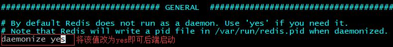
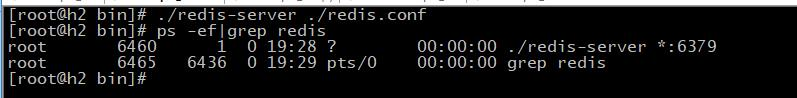
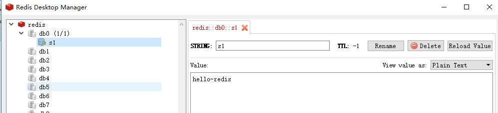
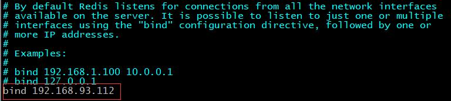
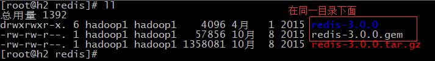
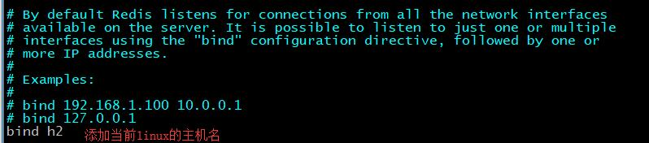
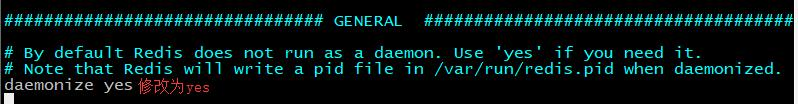
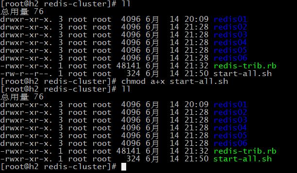
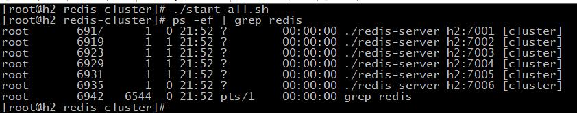
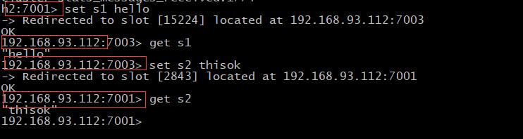

## NoSQL
#### 什么是NoSQL?
   &nbsp;&nbsp;&nbsp;&nbsp;为了解决高并发,高可扩展,高可用,大数据存储问题而产生的数据库解决方案,就是NoSQL数据库<br/>
   &nbsp;&nbsp;&nbsp;&nbsp;泛指非关系型的数据库，NoSQL即Not-Only SQL，它可以作为关系型数据库的良好补充。但是它不能替代关系型数据库，而且它是**存储在内存**中，所以它的**访问速度很快**。
   
#### Nosql的数据库分类   
  - 键值(Key-Value)存储数据库<br/>
    相关产品： Tokyo Cabinet/Tyrant、Redis、Voldemort、Berkeley DB<br/>
    典型应用： 内容缓存，主要用于处理大量数据的高访问负载。 <br/>
    数据模型： 一系列键值对<br/>
    优势： 快速查询<br/>
    劣势： 存储的数据缺少结构化<br/>
    
  - 列存储数据库<br/>
    相关产品：Cassandra, HBase, Riak<br/>
    典型应用：分布式的文件系统<br/>
    数据模型：以列簇式存储，将同一列数据存在文件系统中<br/>
    优势：查找速度快，可扩展性强，更容易进行分布式扩展<br/>
    劣势：功能相对局限<br/>
    
  - 文档型数据库<br/>
    相关产品：CouchDB、MongoDB<br/>
    典型应用：Web应用（与Key-Value类似，Value是结构化的）<br/>
    数据模型： 一系列键值对<br/>
    优势：数据结构要求不严格<br/>
    劣势： 查询性能不高，而且缺乏统一的查询语法<br/>
    
  - 图形(Graph)数据库<br/>
    相关数据库：Neo4J、InfoGrid、Infinite Graph<br/>
    典型应用：社交网络<br/>
    数据模型：图结构<br/>
    优势：利用图结构相关算法。<br/>
    劣势：需要对整个图做计算才能得出结果，不容易做分布式的集群方案<br/>
 
### Redis
  - Redis介绍<br/>
     Redis是用C语言开发的一个开源的高性能键值对（key-value）数据库。
     它通过提供多种键值数据类型来适应不同场景下的存储需求，
     目前为止Redis支持的键值数据类型如下:
       - 字符串类型
       - 散列类型
       - 列表类型
       - 集合类型
       - 有序集合类型
  - Redis发展历史<br/>
    &nbsp;&nbsp;&nbsp;&nbsp;2008年，意大利的一家创业公司Merzia推出了一款基于MySQL的网站实时统计系统LLOOGG，
    然而没过多久该公司的创始人 Salvatore Sanfilippo便对MySQL的性能感到失望，
    于是他决定亲自为LLOOGG量身定做一个数据库，并于2009年开发完成，这个数据库就是Redis。 
    不过Salvatore Sanfilippo并不满足只将Redis用于LLOOGG这一款产品，而是希望更多的人使用它，
    于是在同一年Salvatore Sanfilippo将Redis开源发布，并开始和Redis的另一名主要的
    代码贡献者Pieter Noordhuis一起继续着Redis的开发，直到今天。<br/>
    
    &nbsp;&nbsp;&nbsp;&nbsp;Salvatore Sanfilippo自己也没有想到，短短的几年时间，Redis就拥有了庞大的用户群体。
    Hacker News在2012年发布了一份数据库的使用情况调查，结果显示有近12%的公司在使用Redis。
    国内如新浪微博、街旁网、知乎网，国外如GitHub、Stack Overflow、Flickr等都是Redis的用户。<br/>
    
    &nbsp;&nbsp;&nbsp;&nbsp;VMware公司从2010年开始赞助Redis的开发， Salvatore Sanfilippo和Pieter Noordhuis也分别在3月和5月加入VMware，
    全职开发Redis。<br/>
     
  - Redis应用场景<br/>
    缓存（数据查询、短连接、新闻内容、商品内容等等）。（最多使用）<br/>
    分布式集群架构中的session分离。<br/>
    聊天室的在线好友列表。<br/>
    任务队列。（秒杀、抢购、12306等等）<br/>
    应用排行榜。<br/>
    网站访问统计。<br/>
    数据过期处理（可以精确到毫秒）<br/>
  
  - redis的特性<br/>
    1. redis数据访问速度快（数据在内存中）
    2. redis有数据持久化机制（持久化机制有两种：
        1. 定期将内存数据dump到磁盘；
        2. aof(append only file)持久化机制——用记日志的方式记录每一条数据更新操作，一旦出现灾难事件，可以通过日志重放来恢复整个数据库）
    3. redis支持集群模式（容量可以线性扩展），从3.0.0版本开始支持集群模式。
    4. redis相比其他缓存工具（ehcach/memcached），有一个鲜明的优势：支持丰富的数据结构
  
  - Redis 官网:**[http://redis.io/](http://redis.io/)**
  
  - Redis安装环境
    Redis安装一般会在Linux系统下进行安装，又因为redis是使用c语言开发，所以需要c语言环境。
     - Linux：centOS
     - C语言环境：
     
  - 安装步骤:
    1. 在Linux系统中安装c语言环境:`yum install -y gcc-c++`
    2. 将redis的源码包上传到Linux系统并解压
    3. 进入redis 安装包,然后执行make命令，编译redis的源码
       ```sbtshell
           make
       ```
    4. 安装
       ```sbtshell
           make install PREFIX=/usr/install/redis
       ```
  - 启动集群:
    - 执行cp命令将redis解压缩包中的redis.conf文件拷贝到/usr/install/redis/bin目录下
    - 修改redis.conf<br/>
        
    - 进入到redis的安装目录(/use/install/redis/)下的bin下启动redis服务:
        ```sbtshell
          ./redis-server ./redis.conf
        ```
    - 查看redis服务进程:<br/>
        
       
    - 关闭redis服务进程:<br/>
        ```sbtshell
          ./redis-cli shutdown
        ```
  - 客户端连接redis服务,测试是否能正常使用
    - 客户端连接:
        ```sbtshell
          ./redis-cli -h h2 -p 6379
          
          [root@h2 bin]# ./redis-server ./redis.conf 
          [root@h2 bin]# ./redis-cli -h h2 -p 6379   
          h2:6379> set s1 hello-redis
          OK
          h2:6379> get s1
          "hello-redis"
          h2:6379> 
        ```
    - 使用windows桌面客户端RedisDesktopManager连接测试:
        - 安装redis桌面管理工具
        - 创建连接:
            - 点击RedisDesktopManager底部的"+ Connect to Redis Server" 按钮
            - 如下配置:<br/>
                
            - 查看上面测试时存储的值:<br/>
                
                
        - 如果ip地址连接失败,在redis.conf文件中,下面位置添加下面内容,并关闭防火墙,然后重启服务<br/>
            
        
        以上是单节点Redis服务搭建.
  
### Redis集群
  - Redis架构图<br/>
    
     - 1、集群通信是通过“ping-pong”机制进行通信；
     - 2、客户端不需要将所有的节点都连接上，只需要连接其中一个节点即可。
     - 3、集群中存储数据是存储到一个个的槽中，集群中槽的个数是固定的：16384，槽的编号是【0-16383】。
          在集群中存储数据时，会根据key进行计算，计算出一个结果，然后将这个结果和16384取余，余数就是这个key将要存储的槽的编号。<br/>
         **注意：槽的编号之间不能断开。**<br/>
         槽的计算会将数据保存的很平均，不会产生一个槽满一个槽空的情况。
         
  - redis-cluster投票:容错<br/>        
    
    
     - 什么时候整个集群不可用(cluster_state:fail)? 
        1. 如果集群任意master挂掉,且当前master没有slave.
           集群进入fail状态,也可以理解成集群的slot映射[0-16383]不完成时进入fail状态
           
        2. 如果集群超过半数以上master挂掉，无论是否有slave集群进入fail状态
        
  
  - Redis集群搭建(在同一台机器上(按不同端口号来区分)).
    - 由于集群的脚本是用ruby语言编写的，所以需要准备ruby的环境
        - ruby的环境:安装ruby
            - `yum install -y ruby`
            - `yum install -y rubygems`
            
        - 安装ruby和redis的接口程序
            - 拷贝redis-3.0.0.gem到redis安装包解压目录所在的目录下<br/>
                
            - 执行： `gem install /usr/local/redis-3.0.0.gem`
                ```sbtshell
                   [root@h2 redis]# gem install redis-3.0.0.gem 
                   Successfully installed redis-3.0.0
                   1 gem installed
                   Installing ri documentation for redis-3.0.0...
                   Installing RDoc documentation for redis-3.0.0...
                   [root@h2 redis]# 
                ```
    
    - 在上面已经编译过的redis安装包目录下,将redis重新安装一份到/usr/install/目录下:
        ```sbtshell
          make install PREFIX=/usr/install/redis-cluster/redis01
        ```
    - 执行cp命令将redis解压缩包中的redis.conf拷贝到redis01的bin目录下:
        ```sbtshell
          cp redis.conf /usr/install/redis-cluster/redis01/bin
        ```
    - 需要需改redis.conf的几个地方:
        1. 设置集群模式:<br/>
            
        2. 添加当前机器的主机名(hostname)<br/>
            
        
        3. 设置后台运行模式:<br/>
            
    
    - 在复制5份redis01,分别命名为redis02,redis03,redis04,redis05,redis06
        ```sbtshell
          [root@h2 redis-cluster]# ll
          总用量 4
          drwxr-xr-x. 3 root root 4096 6月  14 20:09 redis01
          [root@h2 redis-cluster]# cp -r redis01 redis02
          [root@h2 redis-cluster]# cp -r redis01 redis03
          [root@h2 redis-cluster]# cp -r redis01 redis04
          [root@h2 redis-cluster]# cp -r redis01 redis05
          [root@h2 redis-cluster]# cp -r redis01 redis06
          [root@h2 redis-cluster]# ll
          总用量 24
          drwxr-xr-x. 3 root root 4096 6月  14 20:09 redis01
          drwxr-xr-x. 3 root root 4096 6月  14 21:28 redis02
          drwxr-xr-x. 3 root root 4096 6月  14 21:28 redis03
          drwxr-xr-x. 3 root root 4096 6月  14 21:28 redis04
          drwxr-xr-x. 3 root root 4096 6月  14 21:28 redis05
          drwxr-xr-x. 3 root root 4096 6月  14 21:28 redis06
          [root@h2 redis-cluster]# 

        ```
    - 分别修改redis01-redis06里面bin目录下的redis.conf中端口号的位置,将端口号分别修改为:<br/>
        redis01:7001<br/>
        redis02:7002<br/>
        redis03:7003<br/>
        redis04:7004<br/>
        redis05:7005<br/>
        redis06:7006<br/>
       ```sbtshell
          #同时编辑多个文件的命令 ,其中-O是水平排列,-o是垂直排列
          vim -O redis01/bin/redis.conf redis02/bin/redis.conf \
          redis03/bin/redis.conf redis04/bin/redis.conf \
          redis05/bin/redis.conf redis06/bin/redis.conf
          
          #在vim的命令行模式下,ctrl+ww进行文件切换
          # 修改完后vim命令行输入wqall全部保存退出.
       ``` 
       
       
    - 将上面redis-3.0.0的redis解压目录下的src目录下,会有一个`redis-trib.rb`文件,
        将这个文件拷贝到/usr/install/redis-cluster目录下:
        ```sbtshell
          [root@h2 src]# pwd
          /home/hadoop1/devlop_env/redis/redis-3.0.0/src
          [root@h2 src]# ll *.rb
          -rwxrwxr-x. 1 hadoop1 hadoop1 48141 4月   1 2015 redis-trib.rb
          [root@h2 src]# cp redis-trib.rb /usr/install/redis-cluster/
          [root@h2 src]# 
        ```
    - 编写启动6台redis的脚本:`vim start-all.sh`
        ```sbtshell
          #!/bin/bash
          cd redis01/bin
          ./redis-server ./redis.conf
          cd ../..
          cd redis02/bin
          ./redis-server ./redis.conf
          cd ../..
          cd redis03/bin
          ./redis-server ./redis.conf
          cd ../..
          cd redis04/bin
          ./redis-server ./redis.conf
          cd ../..
          cd redis05/bin
          ./redis-server ./redis.conf
          cd ../..
          cd redis06/bin
          ./redis-server ./redis.conf
          cd ../..
        ```
    - 修改vim start-all.sh的执行权限:`chmod a+x start-all.sh`
        
    
    - 执行start-all.sh  启动集群.<br/>
        
        
    - 上面启动的6个redis进程还是单节点模式的,需要使用redis-trib.rb 脚本来启动集群.<br/>
        执行命令:
        ```sbtshell
          ./redis-trib.rb create --replicas 1 192.168.93.112:7001  192.168.93.112:7002  192.168.93.112:7003  192.168.93.112:7004  192.168.93.112:7005  192.168.93.112:7006
        ```
        结果如下表示启动成功
        ```sbtshell
          [root@h2 redis-cluster]# ./redis-trib.rb create --replicas 1 192.168.93.112:7001  192.168.93.112:7002  192.168.93.112:7003  192.168.93.112:7004  192.168.93.112:7005  192.168.93.112:7006
          >>> Creating cluster
          Connecting to node 192.168.93.112:7001: OK
          Connecting to node 192.168.93.112:7002: OK
          Connecting to node 192.168.93.112:7003: OK
          Connecting to node 192.168.93.112:7004: OK
          Connecting to node 192.168.93.112:7005: OK
          Connecting to node 192.168.93.112:7006: OK
          >>> Performing hash slots allocation on 6 nodes...
          Using 3 masters:
          192.168.93.112:7001
          192.168.93.112:7002
          192.168.93.112:7003
          Adding replica 192.168.93.112:7004 to 192.168.93.112:7001
          Adding replica 192.168.93.112:7005 to 192.168.93.112:7002
          Adding replica 192.168.93.112:7006 to 192.168.93.112:7003
          M: bbcd975736235fc5630951ba694b3070295b6343 192.168.93.112:7001
             slots:0-5460 (5461 slots) master
          M: d5591a8bd963c955a08119f1ca02397e830ffd97 192.168.93.112:7002
             slots:5461-10922 (5462 slots) master
          M: fc2cc2b6051201bab710cfed059de46cab15989f 192.168.93.112:7003
             slots:10923-16383 (5461 slots) master
          S: ef9dddd2e9ab4b4b3926f8005554e15b960560b3 192.168.93.112:7004
             replicates bbcd975736235fc5630951ba694b3070295b6343
          S: 1b09ab2a0bebf2715fee17517f59c9b35905128c 192.168.93.112:7005
             replicates d5591a8bd963c955a08119f1ca02397e830ffd97
          S: 9b46702167cea3f656ca7e7b1cdd3faaef3a7404 192.168.93.112:7006
             replicates fc2cc2b6051201bab710cfed059de46cab15989f
          Can I set the above configuration? (type 'yes' to accept): yes
          >>> Nodes configuration updated
          >>> Assign a different config epoch to each node
          >>> Sending CLUSTER MEET messages to join the cluster
          Waiting for the cluster to join....
          >>> Performing Cluster Check (using node 192.168.93.112:7001)
          M: bbcd975736235fc5630951ba694b3070295b6343 192.168.93.112:7001
             slots:0-5460 (5461 slots) master
          M: d5591a8bd963c955a08119f1ca02397e830ffd97 192.168.93.112:7002
             slots:5461-10922 (5462 slots) master
          M: fc2cc2b6051201bab710cfed059de46cab15989f 192.168.93.112:7003
             slots:10923-16383 (5461 slots) master
          M: ef9dddd2e9ab4b4b3926f8005554e15b960560b3 192.168.93.112:7004
             slots: (0 slots) master
             replicates bbcd975736235fc5630951ba694b3070295b6343
          M: 1b09ab2a0bebf2715fee17517f59c9b35905128c 192.168.93.112:7005
             slots: (0 slots) master
             replicates d5591a8bd963c955a08119f1ca02397e830ffd97
          M: 9b46702167cea3f656ca7e7b1cdd3faaef3a7404 192.168.93.112:7006
             slots: (0 slots) master
             replicates fc2cc2b6051201bab710cfed059de46cab15989f
          [OK] All nodes agree about slots configuration.
          >>> Check for open slots...
          >>> Check slots coverage...
          [OK] All 16384 slots covered.
          
        ```
    - 在启动集群时需要注意以下几点:
        1. 在拷贝之前确保每个redis里面都没有存储过任何数据,如果有,需要先删除每个redis/bin下的dump.rdb文件
        2. 由于redis-trib.rb 对域名或主机名支持不好,故在创建集群的时候要使用ip:port的方式
        3. 如果启动时报:`call': ERR Slot 4648 is already busy (Redis::CommandError) 这样的问题,可能是
            首次启动失败导致,需要删除每个节点下面的nodes.conf,然后在重新启动redis-server,最后在创建集群.
            
    - 连接集群
        - 连接集群时,只需要连接一个节点即可:
            ```sbtshell
              ./redis-cli -h h2 -p 7001 -c #注意 -c表示连接集群.
            ```
        - 连接成功后,可查看集群信息:
            ```sbtshell
              h2:7001> cluster info
              cluster_state:ok
              cluster_slots_assigned:16384
              cluster_slots_ok:16384
              cluster_slots_pfail:0
              cluster_slots_fail:0
              cluster_known_nodes:6
              cluster_size:3
              cluster_current_epoch:6
              cluster_my_epoch:1
              cluster_stats_messages_sent:1774
              cluster_stats_messages_received:1774
              h2:7001> 

            ```
        - 往集群中存点东西测试.
            ```sbtshell
              h2:7001> set s1 hello
              -> Redirected to slot [15224] located at 192.168.93.112:7003
              OK
              192.168.93.112:7003> get s1
              "hello"
              192.168.93.112:7003> set s2 thisok
              -> Redirected to slot [2843] located at 192.168.93.112:7001
              OK
              192.168.93.112:7001> get s2
              "thisok"
              192.168.93.112:7001> 

            ```
            注意观察节点位置的变化:
            