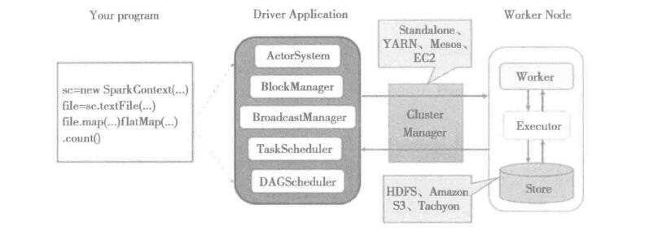

### 1. spark-shell 做了什么?
   - 1.1 在spark-shell中执行WorldCount任务.<br/>
        由spark-shell脚本:
        ```shell
            function main() {
              if $cygwin; then
                # Workaround for issue involving JLine and Cygwin
                # (see http://sourceforge.net/p/jline/bugs/40/).
                # If you're using the Mintty terminal emulator in Cygwin, may need to set t
            he
                # "Backspace sends ^H" setting in "Keys" section of the Mintty options
                # (see https://github.com/sbt/sbt/issues/562).
                stty -icanon min 1 -echo > /dev/null 2>&1
                export SPARK_SUBMIT_OPTS="$SPARK_SUBMIT_OPTS -Djline.terminal=unix"
                "${SPARK_HOME}"/bin/spark-submit --class org.apache.spark.repl.Main --name
            "Spark shell" "$@"
                stty icanon echo > /dev/null 2>&1
              else
                export SPARK_SUBMIT_OPTS
                "${SPARK_HOME}"/bin/spark-submit --class org.apache.spark.repl.Main --name
            "Spark shell" "$@"
              fi
            }
        ```
        
        里面执行运行了 spark-submit 脚本,打开Spark-submit脚本:
        
        ```sbtshell
            if [ -z "${SPARK_HOME}" ]; then
              export SPARK_HOME="$(cd "`dirname "$0"`"/..; pwd)"
            fi
            
            # disable randomized hash for string in Python 3.3+
            export PYTHONHASHSEED=0
            
            exec "${SPARK_HOME}"/bin/spark-class org.apache.spark.deploy.SparkSubmit "$@"
        ```
        spark-submit中运行了spark-class脚本,在执行spark-class脚本时,传递了一个参数 `org.apache.spark.deploy.SparkSubmit`
        打开spark-class脚本:
        
        ```sbtshell
            # Find the java binary
            if [ -n "${JAVA_HOME}" ]; then
              RUNNER="${JAVA_HOME}/bin/java"
            else
              if [ `command -v java` ]; then
                RUNNER="java"
              else
                echo "JAVA_HOME is not set" >&2
                exit 1
              fi
            fi
        ```
        
        由上面的的spark脚本分析,spark启动了以SparkSubmit为主类的JVM进程.
    
   - Spark核心功能:   
        - SparkContext: 
            - SparkContext内置的DAGSchedular负责创建Job,将DAG中的RDD划分到不同的Stage,提交Stage等功能.
            - SparkContext内置的TaskScheduler负责资源的申请,任务的提交以及请求集群对任务的调度等工作.
        - 存储体系:
            - spark优先考录是用个各个节点的内存作为存储,当内存不足时才会开绿使用磁盘,这样做的优点有:
                - 1.极大的减少了磁盘的I/O
                - 2.提升了任务执行效率,使得Spark适用于实时计算,流式计算等场景.
        - 计算引擎:
            - 计算引擎有SparkContext中的DAGScheduler,RDD以及具体节点上的Executor负责执行的Map和Reduce任务
                组成.DAGScheduler和RDD虽然位于SparkContext内部,但是在任务正式提交与执行之前会将Job中的RDD
                组织成有向无关图(DAG),并对Stage进行划分,决定了任务执行阶段的任务的数量,迭代计算,Shuffle等过程.
        - 部署模式:
            - 由于单节点不足以提供足够的存储及计算能力,所以作为大数据处理的Spark,Mesos等分布式资源管理系统的支持,
                通过使用Standalone,Yarn,Mesos等部署模式为Task分配计算资源,提高任务的执行并发效率,除了可以用于实际生产环境的Standalone,Yarn,Mesos等
                部署模式以外,Spark还提供了Local模式和local-cluster模式关于开发和调试.
                
   
### Spark模型设计
   1. Spark编程模型<br/>
       Spark应用程序从编写到提交,执行,输出的整个过程如图所示:<br/>
       
       <br/>
       图中描述的步骤如下:
        1. 用户使用SparkContext提供的API编写Driver Application程序.此外SQLContext,HiveContext,StreamingContext对SparkContext
           进行封装,并提供了SQL,Hive及流式计算相关的API.
           
        2. 使用SparkContext提交的用户应用程序,首先会使用BlockManager和BroadcastManager将任务的Hadoop配置进行广播.
           然后由DAGScheduler将任务转换为RDD并组织成DAG,DAG还将被划分为不同的Stage.
           最后由TaskScheduler借助ActorSystem将任务提交给集群管理器(Cluster Manager) 
   
        3. 集群管理器(Cluster Manager)给任务分配资源,即将具体的任务分配到Worker上,Worker创建Executor来处理任务的运行.
           Standalone,YARN,Mesos,EC2等都可以作为Spark的集群管理.
   
   
   
   
   
   
   
   
   
   
   
   
   
   
   
   
   
   
   
   
   
   
   
   
   
   
   
   
   
   
   
   
   
   
   
   
   
   
   
   
   
   
   
   
   
   
   
   
   
   
   
   
   
   
   
   
   
   
   
   
   
   
   
   
   
   
   
   
   
   
   
   
   
   
   
   
   
   
   
   
   
   
   
   
   
   
   
   
   
   
   
   
   
   
   
   
   
   
   
   
   
   
   
   
   
   
   
   
   
   
   
   
   
   
   
   
   
   
   
   
   
   
   
   
   
   
   
   
   
   
   
   
   
   
   
   
   
   
   
   
   
   
   
   
   
   
   
   
   
   
   
   
   
   
   
   
   
   
   
   
   
   
   
   
   
   
   
   
   
   
   
   
   
   
   
   
   
   
   
   
   
   
   
   
   
   
   
   
   
   
   
   
   
   
        